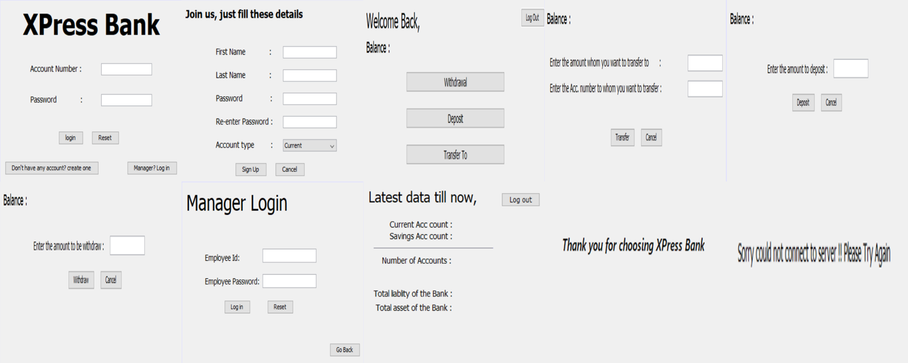
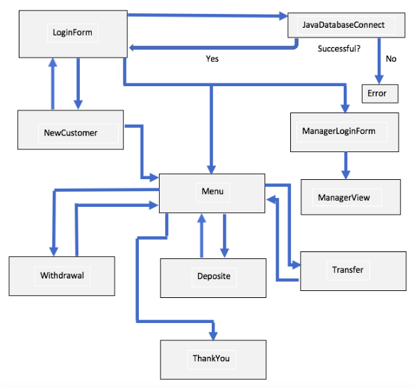

## XPress Bank – Java Mini Project

**A Java-based banking application for creating and managing Savings and Current accounts, featuring user and manager roles, overdraft facilities, and secure transactions.**

---

### **Project Overview**

XPress Bank is a Java mini project developed as part of the Programming in Java course at Shri Bhagubhai Mafatlal Polytechnic. It simulates a basic banking system allowing new customers to open accounts, existing customers to manage their finances, and bank managers to oversee key statistics and operations.

---

### **Features**

- **Account Management**
    - New customers can create Savings or Current accounts.
    - Secure login for all account holders using account number and password.
- **Banking Operations**
    - Deposit and withdraw funds.
    - Transfer money between accounts.
    - Overdraft facility:
        - *Savings Account*: Up to ₹5,000 at 4% interest.
        - *Current Account*: Up to ₹20,000 at 6% interest.
    - Savings account withdrawal limit: 4 times.
    - Real-time balance checking.
- **Manager Dashboard**
    - View total number of Savings and Current accounts.
    - Monitor total accounts, bank liabilities, and assets.
- **Data Persistence**
    - All transactions and changes are reflected in the database for up-to-date information.
 
---

### **Product Prototype**



---

### **Methodology**




---

### **Software Requirements**

- **Java JDK 1.8**
- **NetBeans IDE**
- **XAMPP (MySQL Database)**

---

### **Hardware Requirements**

- Windows 7 or higher (32/64-bit)
- Intel i3 processor (1.30 GHz or better)
- Minimum 4GB RAM
- 250GB free disk space

---

### **Setup Instructions**

1. **Clone the Repository**

```bash
git clone https://github.com/AayushPatel006/BankApplication-Java.git
```

2. **Install Dependencies**
    - Ensure Java JDK 1.8 is installed.
    - Install NetBeans IDE.
    - Set up XAMPP and start the MySQL service.
3. **Database Configuration**
    - Create a MySQL database named `bank`.
    - Update database credentials in the code if necessary (`root` user, no password by default).
4. **Run the Project**
    - Open the project in NetBeans.
    - Build and run the application.

---

### **Module Structure**

- **LoginForm:** Handles user and manager authentication.
- **NewCustomer:** Allows new users to register and create accounts.
- **Menu Frame:** Displays available operations (deposit, withdraw, transfer, balance check).
- **Manager View:** Shows bank statistics and manages accounts.
- **Error/Thank You Frames:** For connection errors and logout confirmation.

---

### **Future Scope**

- Add support for fixed deposit and recurring deposit accounts.
- Implement transaction history and detailed statements.
- Enhance security with encryption and multi-factor authentication.
- Develop a web or mobile interface for broader accessibility.

---

### **Contributing**

Contributions are welcome! Please fork the repository and submit a pull request with detailed information about your changes.

---

### **License**

This project is for educational purposes and does not carry a specific license.

---

### **Author**

Aayush Nayan Patel
Shri Bhagubhai Mafatlal Polytechnic
Roll No: 1991035

---


